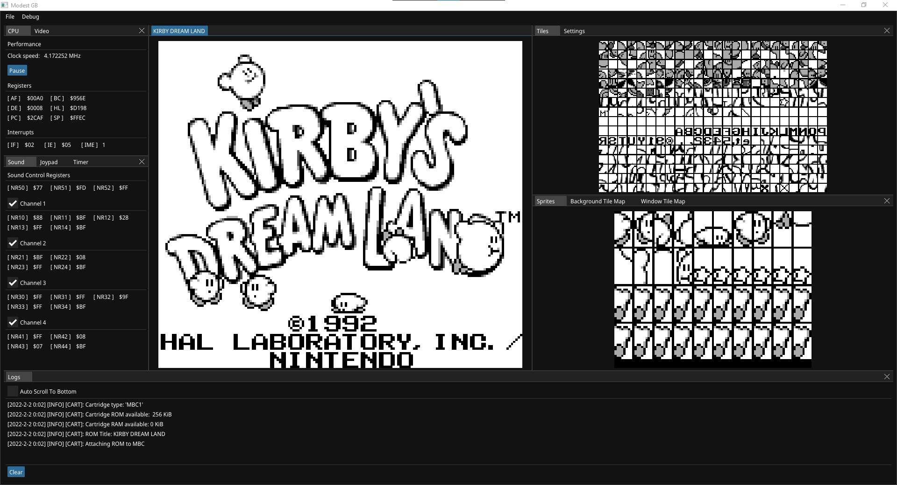

# Modest GB
**Modest GB** is a **Game Boy** Emulator (DMG only) written in **C++**. 




## Building
#### 1. Install **CMake** 3.21 or greater - https://cmake.org/download/
#### 2. Clone the repo and its dependencies:
```
git clone --recurse-submodules https://github.com/ShannonHG/Modest-GB <target-directory>
```
#### 3. Build using **CMake**:
```
cd ../Modest-GB
mkdir build
cd build
cmake ..
cmake --build . --config Release
```
#### 4. The build can be found in *../Modest-GB/build/Release*

## Controller/Keyboard Mapping 
The button mapping can be modified in *File -> Settings -> Controller/Keyboard*, but the default configuration is listed below. In theory, any standard controller should be supported, but the controller button names are based on an Xbox controller's layout.

| Game Boy | Controller | Keyboard |
|----------|------------|----------|
|A         |A           |J         |
|B         |B           |K         |
|Start     |Start       |P         |
|Select    |Menu        |O         |
|Right     |D-pad Right |D         |
|Left      |D-pad Left  |A         |
|Up        |D-pad Up    |W         |
|Down      |D-pad Down  |S         |

## Audio
When the emulator is opened, it will attempt to select the audio output device saved in the *Modest-GB.config* file. However, if the configuration file does net exist yet, or the selected output device is not currently connected, then the first available output device will be used instead. The ouput device can be changed at any time by navigating to *File -> Settings -> Audio*, and changing the **Output Device** setting.

## Saved Data
By default, saved data is stored in *../Modest-GB/Saved-Data*. However, the emulator can also be configured to store saved data in the same folder as the ROM file. This can be done by navigating to *File -> Settings -> Saved Data*, and changing **Saved Data Location** to **ROM Directory**.

## Dependencies
* SDL - https://www.libsdl.org/
* yaml-cpp - https://github.com/jbeder/yaml-cpp/
* Dear ImGui - https://github.com/ocornut/imgui
* Native File Dialog Extended - https://github.com/btzy/nativefiledialog-extended

## References
* Pan Docs - https://gbdev.io/pandocs/
* gbops - https://izik1.github.io/gbops/index.html
* Additional opcode table - https://meganesulli.com/generate-gb-opcodes/
* Game Boy: Complete Technical Reference - https://github.com/Gekkio/gb-ctr
* Game Boy Sound Hardware Documentation - https://gbdev.gg8.se/wiki/articles/Gameboy_sound_hardware
* The Ultimate Game Boy Talk - https://www.youtube.com/watch?v=HyzD8pNlpwI
